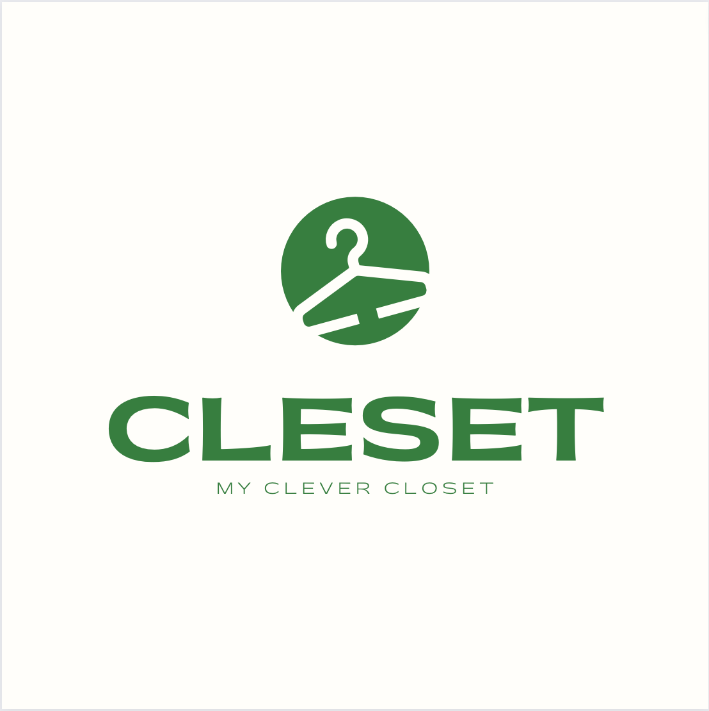

# 소프트웨어공학 3조

---

## 팀 구성

### 팀장

- [201710939 엄태양 (컴퓨터과학과)](https://github.com/SunEom)

### 팀원

- [201710909 김재우 (컴퓨터과학과)](https://github.com/AshRainK)
- [201710931 박채은 (컴퓨터과학과)](https://github.com/CHAEEUNPAKR)
- [201710992 최미희 (컴퓨터과학과)](https://github.com/MiheeChoi)
- [201810925 김창욱 (컴퓨터과학과)](https://github.com/Kimchangwook)

---

# 프로젝트명 : Cleset

나의 똑똑한 옷장 Cleset은 영리하다는 뜻을 가진 단어 Clever와 옷장을 의미하는 단어 Closet의 합성어입니다 !

이것 저것 신경쓸 것도 많은 요즘 누구보다 똑똑하고 편리하게 의류 관리를 시작해보세요 !
